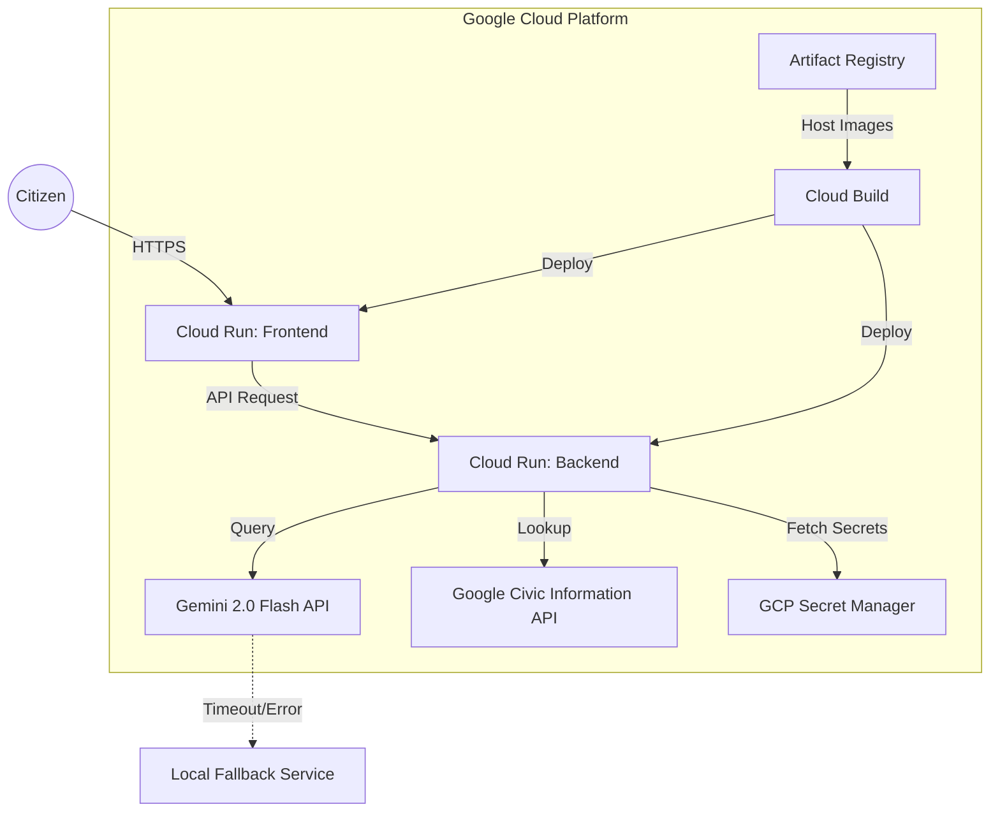

# VoteWise AI Architecture

This document outlines the technical architecture of the VoteWise AI platform, a production-grade civic-tech application built entirely on Google Cloud.

## 🏗️ System Overview

VoteWise AI is designed as a decoupled, micro-containerized system optimized for Google Cloud Run. It leverages the modern Gemini 2.0 Flash model for natural language processing and is hardened with a rule-based fallback engine for high availability.

### High-Level Architecture Diagram

## 🛠️ Component Breakdown

### 1. Frontend (Presentation Layer)
- **Tech Stack**: Vanilla HTML5, CSS3, JavaScript.
- **Serving**: Nginx on Cloud Run.
- **Optimization**: Gzip compression, edge caching, and responsive glassmorphism UI.
- **Accessibility**: WCAG 2.1 AA compliant, screen-reader optimized.

### 2. Backend (Intelligence Layer)
- **Framework**: FastAPI (Python 3.10).
- **AI Processing**: Modular prompt engineering system.
- **Resilience**: Implements a "Graceful Degradation" pattern with a local rule-based engine.
- **Security**: Non-root container execution, Secret Manager integration.

### 3. CI/CD (DevOps Layer)
- **Build**: Google Cloud Build with Artifact Registry.
- **Triggers**: Automated deployments on `git push`.
- **Secret Management**: API keys are NEVER hardcoded; they are injected via GCP Secret Manager at runtime.

## 🛡️ Responsible AI & Explainability
- **Neutrality Guardrails**: System prompts strictly enforce non-partisan responses.
- **Disclaimers**: Every AI response includes a disclaimer about AI-generated content.
- **Transparency**: The platform provides direct links to official civic sources via the Google Civic API.

## 🚀 Scalability
Cloud Run's autoscaling ensures the platform can handle sudden spikes in traffic (e.g., on Election Day) while maintaining zero costs during idle periods.
